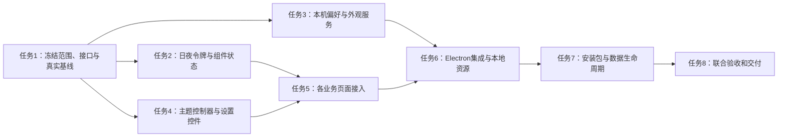

# 日夜手账风与独立桌面软件 Implementation Plan

> **For agentic workers:** REQUIRED SUB-SKILL: Use superpowers:subagent-driven-development (recommended) or superpowers:executing-plans to implement this plan task-by-task. Steps use checkbox (`- [ ]`) syntax for tracking.

**Goal:** 为事务助手建立统一的日间、夜间手账视觉系统，并以可独立安装和运行的 Windows 桌面软件交付，同时保留页面排版持续优化的空间。

**Architecture:** 现有 Electron 主进程继续负责本地数据、窗口、托盘、邮箱与模型调用，React 界面通过受限 preload API 使用服务。新增独立外观服务负责偏好持久化和跨窗口主题同步；主题令牌和基础组件与页面布局解耦，生产界面加载安装包内资源。

**Tech Stack:** 沿用项目已配置的 Electron、React 19、TypeScript、electron-vite、Vite、sql.js、Vitest、Testing Library 与 jsdom；Windows 安装使用 electron-builder/NSIS。主题使用 CSS 变量及 Electron nativeTheme，不引入新 UI 框架、动画引擎或网页托管服务。

**Spec:** 本文件第 1—4 节完整定义用户已确认的设计范围、桌面交付目标、协作边界与契约，是后续任务的直接依据。关联业务接口参见 [邮箱计划](2026-09-15-multi-mailbox.md) 和 [桌宠计划](2026-09-15-chibi-desktop-pet.md)；本计划可独立领取执行，不要求阅读浏览器预览源码来猜测需求。

## Global Constraints

- 用户于 2026-09-17 接受温柔手账风及其深色版本。确定的是配色、纸张/便签质感和整体气质，页面排版仍然开放。
- 预览中的首页、导航顺序、三栏结构、卡片尺寸/位置、搜索快捷键和示例数字均不构成功能或布局承诺。
- 独立软件指当前 ai-desk-companion 项目整体交付为 Windows 应用，包含工作台、桌宠与信息面板；不拆成另一个只展示主题的应用。
- 终端用户可从安装后的快捷方式或应用 exe 启动，无需浏览器、Node/npm、开发命令或本地预览服务器。
- HTML/CSS/React 是应用内部界面技术；生产窗口由 Electron 加载安装包内页面，不以打开浏览器 HTML 或 localhost 网址作为交付。
- 本地待办、日历和已缓存内容应可离线访问；邮箱同步、在线模型分析仍按原设计需要网络及用户配置，不承诺完全离线 AI。
- 本轮只新增这份计划文档，不修改现有代码、配置、旧计划，不执行安装、打包、发布、数据库变更或素材公开分发。
- 用户现有及其他开发任务的改动必须保留。实际实施开始前重新核对文件状态和责任人，不能按旧计划覆盖已经完成的实现。

## 1. 产品约定：风格固定，排版可演进

### 1.1 视觉语言

日间模式采用奶油纸面、灰玫瑰强调色和温和的深色文字。夜间模式采用暖炭灰纸面、低饱和玫瑰色、暖白正文与暗金装饰，保留便签的生活感。纹理只用于低信息密度背景或局部装饰，不叠加到邮件正文、表格、编辑器和密集列表上。纸胶带、手写标题等装饰只在语义适合时出现，不成为每张卡片的必备元素。

正文优先使用系统可用的 Segoe UI、Microsoft YaHei 和 sans-serif，不依赖远程字体。正文以 14—16px 为起点，辅助信息通常不小于 12px；预览中的 9—11px 小字不作为成品标准。手写风仅可用于少量展示标题，并需有可靠字体回退。颜色状态同时配合文字、图标或形状，不能只凭红/绿区分成功失败。

桌宠继续使用已确认人物图，不对图片做全局反色、染色或暗化。暗色适配作用于气泡、边框和周边界面，透明桌宠窗口始终保持透明。其人物、动画和手势实现仍由桌宠计划负责。

### 1.2 本轮不固定的事项

本计划不规定首页必须叫“今日概览”，不增加预览中的聚合仪表盘或搜索功能，不确定导航位置/顺序，不规定所有页面都使用侧栏加两列卡片，也不要求人物常驻工作台欢迎区域。每个业务页面可采用适合其内容的列表、表单、时间网格、会话或详情布局。

主题接入以当前真实业务页面为基线，保持其数据流和行为。适配过程中可修正文字溢出、键盘焦点、间距和窗口缩放问题；新增首页、调整信息架构、替换导航或重做多栏交互，需在独立的布局设计中说明用户流程和验收范围，再取得用户确认。主题计划完成不代表排版已定稿，后续布局迭代也不应要求重写主题服务。

### 1.3 主题行为默认值

提供“浅色 / 深色 / 跟随系统”三种偏好，首次默认跟随系统。前两种对应用户已确认的日间/夜间手账视觉，跟随系统、偏好存储方式及下述实现参数是本计划提出的工程默认值。选择在本机保存，重启保持；多个已打开窗口同步变化，新打开窗口使用最新状态。

未读取到偏好时使用跟随系统；损坏文件不直接覆盖，先保留原文件并显示可操作提示，只有用户明确修改偏好后才写入有效内容。保存失败保留当前已确认主题，界面告知“外观设置未保存”，不显示成功提示。普通业务备份不携带本机主题偏好，主题设置也不修改模型、邮箱凭据和业务数据库。

## 2. 独立桌面软件的交付定义

首个交付目标为 Windows x64 的 NSIS 安装包和安装后的独立应用。应用具有固定 appId、产品名和图标，提供桌面/开始菜单入口及标准卸载入口。首版按当前用户安装，避免不必要的管理员权限；正式安装/升级/卸载验证在用户明确同意的测试目录或干净虚拟机中执行。

用户关闭工作台时延续托盘驻留行为，托盘能重新打开工作台并明确退出应用。双击快捷方式再次启动应聚焦已有实例，不能生成重复数据库写入者。真正退出时停止计时、连接与后台任务并完成可用数据落盘；隐藏窗口与退出应用应在文案和操作中清楚区分。

界面、脚本、CSS、图标、角色图、sql.js WASM 与运行依赖必须包含在安装产物中。生产窗口不能依赖开发服务器、个人素材目录、.superpowers 预览目录或网络字体。运行需要邮箱与模型网络不等于依赖网页服务器；离线时应用本身仍能启动和使用本地能力。

业务数据存放在稳定的 Electron userData 目录，程序安装目录只放可替换资源。升级默认保留数据库、邮箱配置、主题偏好和业务缓存；卸载默认不自动擦除用户数据，清理个人数据是另一个需要明确确认的动作。代码签名和 SmartScreen 状态单独记录，未签名测试包不宣称具备可信发布签名，也不要求用户关闭系统安全防护。

安装包不自动公开上传；公开发布前还需核实角色素材和第三方资源许可。Windows x64 范围不隐含 ARM、macOS、Linux、自动更新、开机自启或 Microsoft Store 发布，这些独立评估。

## 3. 当前基线、文件地图与并行责任

2026-09-17 只读检查发现，package.json 已配置 Electron 入口、electron-vite 构建、electron-builder 与 NSIS，renderer 构建入口包含 workbench、pet、panel。因此本任务是在现有桌面应用中实现主题和完成交付验证，技术路线无需改为浏览器产品，也无需重建一个仓库。

工作区同时存在邮箱、桌宠及共享入口的开发改动，package.json 已列出邮箱与 UI 测试依赖。此事实只表明文件已有变更，不代表安装、测试、构建或功能完成。本计划中的测试命令均为待执行步骤；实施者需依据当时实际依赖和代码建立基线。

| 文件或模块 | 责任 | 所有者 |
| --- | --- | --- |
| `src/shared/appearance.ts` | 偏好/快照/返回值类型和通道常量 | R 共用接口 |
| `src/main/appearance/{store,service,ipc}.ts` | 独立偏好文件、nativeTheme 同步、受限 IPC | U-N 外观服务 |
| `src/renderer/shared/theme/{palettes,tokens,components}.css` | 全局语义色、材质与基础交互状态 | U-V 视觉基础 |
| `src/renderer/shared/theme/{controller,bootstrap}.ts` | 订阅、快照竞态、启动回退和文档主题 | U-I 主题交互 |
| `src/renderer/shared/theme/AppearanceSettings.tsx` | 外观偏好控件 | U-I |
| `src/renderer/shared/ui.css` | 既有颜色替换为主题变量，保留布局规则 | U-V 唯一改写 |
| `src/renderer/workbench/pages/*.tsx` | 本页硬编码色和状态适配 | 各页面原所有者 |
| `src/renderer/workbench/pages/SettingsPage.tsx` | 插入外观控件，不改变模型设置行为 | D/设置页所有者 |
| `src/renderer/{workbench,panel,pet}/*main.tsx` | 在渲染前启动主题控制器 | 各入口所有者，R 集成 |
| `src/renderer/pet/pet.css`、`PetBubbles.tsx` | 透明窗口及气泡主题接线 | P 桌宠 |
| `src/renderer/workbench/mail/` | 邮箱外壳与状态适配 | D 邮箱 UI |
| `src/main/{index,windows,ipc,tray}.ts` | 初始化、背景色、资源加载、窗口和退出 | R 统一集成 |
| `src/shared/api.ts`、`src/preload/index.ts` | AppearanceApi 桥接 | R |
| `package.json`、lock、构建/测试配置 | 资源打包和共用脚本 | P0/R |
| `tests/appearance/`、`tests/ui/appearance/` | 服务/状态/组件测试 | 对应 U 区作者 |
| `tests/desktop/`、`scripts/verify-desktop-artifact.mjs` | 产物静态验证，不做自动卸载/删数据 | R |
| `docs/日夜主题与桌面交付验收.md` | 实施阶段填写的真实证据 | R |

U-V、U-N、U-I 作为新增功能分区，先冻结共享契约，再独立开发。U-V 只更改样式令牌和已有公共样式，不能同时改邮箱 D 或桌宠 P 的页面；页面所有者消费令牌并交付适配。R 是原有共享文件的唯一集成人员，禁止本计划和邮箱/桌宠计划同时各自维护一份 package、preload 或 windows 修改。

建议实施分支分别为 `codex/paper-theme-tokens`、`codex/paper-theme-service` 和 `codex/paper-theme-ui`，由既有集成分支汇总。实际开始时遵循 using-git-worktrees 技能及用户并行规范。本轮不创建分支、不安装依赖、不启动实现代理。



## 4. 视觉令牌与主题契约

### 4.1 日夜色彩起点

色值是本计划的实施起点，允许为实际对比度与状态表现作小幅校准。色彩职责固定，业务页面不能自行发明另一套 day/night 规则。

| 语义变量 | 日间 | 夜间 | 用途 |
| --- | --- | --- | --- |
| `--ui-bg` | `#f5f1e9` | `#25232a` | 应用背景 |
| `--ui-surface` | `#fffcf5` | `#312d35` | 实色正文/表单面板 |
| `--ui-surface-nav` | `#faf6ed` | `#2a272e` | 导航及次级背景 |
| `--ui-text` | `#51483f` | `#f0e8df` | 正文 |
| `--ui-text-muted` | `#766556` | `#c0b1b3` | 辅助文字 |
| `--ui-accent` | `#795b75` | `#d7b6c9` | 主交互、链接、选中强调 |
| `--ui-accent-surface` | `#f1e5eb` | `#493e48` | 选中背景 |
| `--ui-on-accent` | `#ffffff` | `#30222b` | 主按钮文字 |
| `--ui-border` | `#e9dfd0` | `#4a4149` | 装饰性分隔线 |
| `--ui-control-border` | `#96818b` | `#b09aa7` | 输入边界、复选框 |
| `--ui-warning-text` | `#855725` | `#e3c394` | 警示文字 |
| `--ui-warning-surface` | `#fbf1e4` | `#4b3c2d` | 警示底色 |

普通文字对其实际背景以 4.5:1 为验收目标，交互边界与焦点以 3:1 为目标；不能只测主文本而漏掉 hover、selected、placeholder、错误或禁用说明。上述浅色辅助文字/面板和强调色/选中背景在预览阶段的计算分别约为 5.44:1、4.81:1；实施时重新自动计算，半透明叠加先合成实际底色后再测。装饰线不代替输入边界。

错误与成功颜色在任务 2 中加入独立语义变量并测试。纸纹透明度、阴影与圆角使用局部语义变量；不把列数、栏宽、卡片高度、导航排序或用户内容尺寸混入主题令牌。数字密集区域保持正常字形，设置可见焦点和明确 loading/empty/error/disabled 状态。

### 4.2 主进程和 renderer 的接口

```ts
// src/shared/appearance.ts
export type ThemeMode = 'light' | 'dark' | 'system'
export type ResolvedTheme = 'light' | 'dark'
export interface AppearanceSnapshot {
  revision: number
  mode: ThemeMode
  resolved: ResolvedTheme
}
export type AppearanceResult =
  | { ok: true; value: AppearanceSnapshot }
  | { ok: false; code: 'INVALID_MODE' | 'STORAGE' | 'UNAVAILABLE'; message: string }
export interface AppearanceApi {
  get(): Promise<AppearanceSnapshot>
  set(mode: ThemeMode): Promise<AppearanceResult>
}
export const AppearanceChannels = {
  get: 'appearance:get', set: 'appearance:set', changed: 'evt:appearance-changed'
} as const

// src/main/appearance/service.ts；无 renderer 实现依赖。
export interface AppearanceStore {
  read(): ThemeMode | null
  write(mode: ThemeMode): Promise<void>
}
export interface NativeThemePort {
  themeSource: ThemeMode
  readonly shouldUseDarkColors: boolean
  onUpdated(listener: () => void): () => void
}
export interface AppearanceService {
  get(): AppearanceSnapshot
  set(mode: ThemeMode): Promise<AppearanceResult>
  dispose(): void
}
export function createAppearanceService(deps: {
  store: AppearanceStore
  native: NativeThemePort
  emit: (snapshot: AppearanceSnapshot) => void
}): AppearanceService

// src/renderer/shared/theme/controller.ts
export interface AppearanceClientPort extends AppearanceApi {
  subscribe(listener: (snapshot: AppearanceSnapshot) => void): () => void
}
export interface AppearanceController {
  start(): Promise<void>
  set(mode: ThemeMode): Promise<AppearanceResult>
  dispose(): void
}
export function createAppearanceController(deps: {
  api: AppearanceClientPort
  apply: (snapshot: AppearanceSnapshot) => void
  unavailable: () => void
}): AppearanceController
```

`createAppearanceService` 先读保存偏好、设置 nativeTheme.themeSource，再创建窗口。nativeTheme.updated 只在最终快照变化时广播；显式 dark/light 模式不被系统外观变化覆盖，system 模式跟随实际 shouldUseDarkColors。revision 在本次进程生命周期内递增，不持久化、不作为业务数据库版本。

客户端先订阅再读取快照，低 revision 的异步响应不覆盖较新事件；start/dispose 幂等，卸载后不触碰 DOM。set 在主进程串行写入，保存成功后才更新可见偏好和广播。原生 setter 或保存失败不能悄悄返回成功；维护旧状态并给出可操作错误，必要时记录不含敏感数据的诊断。

`RendererApi.appearance` 增加以上 API，事件继续由受限订阅适配器提供；浏览器预览中的 choose 函数、全局主题按钮和 session key 不进入生产。主窗口允许修改主题，桌宠/面板只允许读取；只接受本应用受信任窗口的主 frame，不接受邮件 iframe、外部页面或任意路径参数。

偏好文件固定为 `join(app.getPath('userData'), 'appearance.json')`，内容限定 `{ "version": 1, "mode": "system" }` 形状。renderer 无权传路径或读写文件。store 通过同目录临时文件和原子替换保存，失败清理仅限自身临时文件；不存在用默认值，解析失败保留原文件，不能借主题重置删除整个 userData。

## 任务 1：确认真实基线与冻结边界（R）

Files：Create `src/shared/appearance.ts`、`tests/appearance/contract.test.ts`；仅在执行阶段按实际需要接入配置，不在此任务挂尚未实现的 RendererApi.appearance。

Interfaces：产出第 4.2 节共享类型和通道，接口文件不导入尚不存在的业务实现。

- [ ] 检查当前 AGENTS.md、git status 和正在开发的责任范围；记录执行基线 SHA 及未提交文件，保留全部用户改动。核对 node/npm/node_modules 的实际状态，不沿用先前“缺 npm”的历史记录。
- [ ] 在有可用依赖时运行现有 `npm.cmd test`、`npm.cmd run typecheck` 和 `npm.cmd run build`，记录退出码；需要安装、更新核心依赖或覆盖锁文件时按用户规则说明具体范围并取得相应确认。
- [ ] 写运行时校验测试，先要求非法字符串不能被 TypeScript 类型断言绕过：

```ts
import { expect, it } from 'vitest'
import { parseThemeMode } from '../../src/shared/appearance'
it('仅接受三个明确偏好值', () => {
  expect(parseThemeMode('dark')).toBe('dark')
  expect(parseThemeMode('system')).toBe('system')
  expect(parseThemeMode('night')).toBeNull()
  expect(parseThemeMode({ mode: 'dark' })).toBeNull()
})
```

- [ ] `npm.cmd test -- tests/appearance/contract.test.ts` 应因缺函数而失败；实现并复测：

```ts
export function parseThemeMode(value: unknown): ThemeMode | null {
  return value === 'light' || value === 'dark' || value === 'system' ? value : null
}
```

- [ ] 发布接口基线，并将第 1.2 节“排版开放”作为各区交接约束；各区不得复制预览 DOM 作为默认页面实现。测试和类型检查通过后定向提交 `chore(appearance): define desktop theme contracts`。

## 任务 2：日夜令牌与基础交互样式（U-V）

Files：Create `src/renderer/shared/theme/palettes.css`、`tokens.css`、`components.css`、`tests/appearance/contrast.test.ts`、`tests/ui/appearance/components.test.tsx`；Modify `src/renderer/shared/ui.css` 的颜色声明，保留既有布局选择器。

Interfaces：palettes.css 定义每种主题的语义颜色；tokens.css 定义非排版型状态变量；components.css 消费变量。根元素 `data-theme="light|dark"` 为生效主题，不能让业务模块自己监听系统主题。

- [ ] 使用实际 CSS 文件作为测试输入，写颜色对比红灯用例；解析辅助函数只处理此文件明确的十六进制声明，不冒充通用 CSS 解析器：

```ts
import { readFileSync } from 'node:fs'
import { expect, it } from 'vitest'
function luminance(hex: string): number {
  const c = hex.replace('#', '').match(/../g)!.map(x => parseInt(x, 16) / 255)
    .map(x => x <= 0.04045 ? x / 12.92 : ((x + 0.055) / 1.055) ** 2.4)
  return .2126 * c[0] + .7152 * c[1] + .0722 * c[2]
}
function ratio(a: string, b: string): number {
  const x = luminance(a), y = luminance(b)
  return (Math.max(x, y) + .05) / (Math.min(x, y) + .05)
}
it('日夜辅助文字对实际面板均达到4.5', () => {
  const css = readFileSync('src/renderer/shared/theme/palettes.css', 'utf8')
  for (const theme of ['light', 'dark']) {
    const block = css.match(new RegExp(`\\[data-theme="${theme}"\\]\\s*\\{([^}]+)\\}`))?.[1]
    expect(block).toBeTruthy()
    const color = (key: string) => block!.match(new RegExp(`${key}:\\s*(#[0-9a-fA-F]{6})`))![1]
    expect(ratio(color('--ui-text-muted'), color('--ui-surface'))).toBeGreaterThanOrEqual(4.5)
  }
})
```

- [ ] 运行 `npm.cmd test -- tests/appearance/contrast.test.ts`，确认缺文件失败；建立两组完整变量：

```css
[data-theme="light"] {
  --ui-bg: #f5f1e9; --ui-surface: #fffcf5; --ui-text: #51483f;
  --ui-text-muted: #766556; --ui-accent: #795b75;
  --ui-accent-surface: #f1e5eb; --ui-on-accent: #ffffff;
}
[data-theme="dark"] {
  --ui-bg: #25232a; --ui-surface: #312d35; --ui-text: #f0e8df;
  --ui-text-muted: #c0b1b3; --ui-accent: #d7b6c9;
  --ui-accent-surface: #493e48; --ui-on-accent: #30222b;
}
```

补齐第 4.1 节其余变量；成功色用日间 `#35624f`/`#edf4ef`、夜间 `#b8d6bf`/`#293e32`，错误色用日间 `#923d44`/`#faeeee`、夜间 `#f0b6b9`/`#492d33`。将这些实际背景/文字组合加入测试；若对比不达标先修色值，不降低断言阈值。
- [ ] 在 ui.css 内把已有 `--bg/--panel/--text/--text-2/--accent/--border/--sidebar` 等变量映射到语义变量，逐组件清理颜色字面值。保留当前 `.page/.sidebar/.conv-list/.calendar` 的布局逻辑，不引入预览的固定宽高。按钮 foreground 使用 on-accent，不能所有主题都写白色。
- [ ] 覆盖按钮默认/hover/active/disabled、输入/placeholder/error、焦点、链接、标签、选中行、弹窗、tooltip/toast、滚动条；装饰背景只允许 opt-in 类，例如 `.paper-decoration`，正文容器 `.content-surface` 使用纯色。键盘焦点至少2px且不依赖阴影；减少动态效果关闭非必要过渡。
- [ ] 补 UI 样例测试，渲染真实 button/input/tag 类并验证 data-theme、禁用状态和可访问名称；浏览器/Electron 中计算实际颜色，含透明叠加与所有状态。基础样式不通过全局 filter:invert 生成暗色，不修改角色图片。定向测试、类型检查通过后提交 `feat(appearance): add accessible paper day and night tokens`。

## 任务 3：持久化偏好与 nativeTheme 服务（U-N）

Files：Create `src/main/appearance/store.ts`、`service.ts`、`tests/appearance/store.test.ts`、`service.test.ts`。

Interfaces：实现第 4.2 节 AppearanceStore、AppearanceService；导出 `createAppearanceStore(filePath: string, warn: (message: string) => void): AppearanceStore`，路径只由可信主进程传入。

- [ ] 写服务保存失败测试并运行，预期缺模块失败：

```ts
import { expect, it, vi } from 'vitest'
import { createAppearanceService } from '../../src/main/appearance/service'
it('写盘失败不切换已确认偏好或广播成功', async () => {
  const native = { themeSource: 'light' as 'light'|'dark'|'system',
    shouldUseDarkColors: false, onUpdated: () => () => {} }
  const emit = vi.fn()
  const service = createAppearanceService({ native, emit,
    store: { read: () => 'light', write: async () => { throw new Error('disk full') } } })
  const before = service.get()
  expect(await service.set('dark')).toMatchObject({ ok: false, code: 'STORAGE' })
  expect(service.get()).toEqual(before)
  expect(native.themeSource).toBe('light')
  expect(emit).not.toHaveBeenCalled()
  service.dispose()
})
```

- [ ] store.read 验证 schema version=1 和 mode 白名单；不存在返回 null，损坏/未知版本调用固定文案 warn 后回退 null并保留原文件。write 先建立自身目录，将最小JSON写到同目录随机.tmp文件，再 rename 到目标；finally只清理本次临时文件。禁止扫描/删除 userData 或临时文件通配符。
- [ ] 实现串行保存和版本化广播，队列拒绝后可以继续：

```ts
// service 内部片段：commitMode 负责写盘、更新 native 和生成快照。
let queue: Promise<unknown> = Promise.resolve()
function set(mode: ThemeMode): Promise<AppearanceResult> {
  const next = queue.then(() => commitMode(mode))
  queue = next.catch(() => undefined)
  return next
}
```

`commitMode(mode: ThemeMode): Promise<AppearanceResult>` 在 service 内定义：运行时校验 → 相同偏好返回当前快照 → await store.write → 设置 native.themeSource → 读取 shouldUseDarkColors → revision+1 → 广播。处理 native setter 自触发 updated 时做去重/暂缓，不能一次保存广播两次。通知消费者抛错只记录，不让已成功保存变成业务失败；dispose停止新set并退订原生事件。
- [ ] 补测试：首次默认system、显式light/dark不随系统变、system即时跟随、快速dark/light串行且最终值正确、相同mode不重复写、损坏配置保留、未知版本回退、临时写入/rename失败、重启read回保存值、dispose无残留监听。所有磁盘测试使用独立临时目录，不读真实userData。
- [ ] 运行 `npm.cmd test -- tests/appearance/store.test.ts tests/appearance/service.test.ts` 和节点类型检查，通过后提交 `feat(appearance): persist and broadcast desktop theme preference`。

## 任务 4：主题控制器与外观设置控件（U-I）

Files：Create renderer/shared/theme/controller.ts、bootstrap.ts、AppearanceSettings.tsx、`tests/appearance/controller.test.ts`、`tests/ui/appearance/settings.test.tsx`。

Interfaces：实现 AppearanceClientPort/Controller；导出 `applyAppearance(root: HTMLElement, snapshot: AppearanceSnapshot): void`；组件 `AppearanceSettings({ api }: { api: AppearanceClientPort }): JSX.Element`。组件只接收API，不自己读写文件或决定窗口尺寸。

- [ ] 写乱序快照测试，先失败再实现：

```ts
import { expect, it, vi } from 'vitest'
import { createAppearanceController } from '../../src/renderer/shared/theme/controller'
import type { AppearanceSnapshot } from '../../src/shared/appearance'
it('启动快照迟到不覆盖用户刚切换的深色', async () => {
  let listener: (s: AppearanceSnapshot) => void = () => {}
  let resolveGet!: (s: AppearanceSnapshot) => void
  const apply = vi.fn()
  const c = createAppearanceController({ apply, unavailable: vi.fn(), api: {
    get: () => new Promise(r => { resolveGet = r }),
    set: async () => ({ ok: false, code: 'UNAVAILABLE', message: 'test' }),
    subscribe: fn => { listener = fn; return () => {} }
  } })
  const starting = c.start()
  listener({ revision: 2, mode: 'dark', resolved: 'dark' })
  resolveGet({ revision: 1, mode: 'light', resolved: 'light' })
  await starting
  expect(apply).toHaveBeenLastCalledWith({ revision: 2, mode: 'dark', resolved: 'dark' })
  c.dispose()
})
```

- [ ] `start` 先订阅再get，接受有效且更高revision，取消后忽略所有回调；set使用与事件同一路径应用成功快照，失败显示错误，不更改当前已确认选项。重复start不会重复监听。实现 apply：

```ts
export function applyAppearance(root: HTMLElement, s: AppearanceSnapshot): void {
  root.dataset.theme = s.resolved
  root.style.colorScheme = s.resolved
  root.dataset.themeReady = 'true'
}
```

- [ ] bootstrap 在 createRoot/render 前启动控制器，fallback 按 window.matchMedia('(prefers-color-scheme: dark)')读取 nativeTheme已经设置后的结果。正常等待本地IPC期间内容暂不可见但窗口背景色一致；3秒超时或IPC拒绝后应用fallback并显示非阻断提示，不能永久白屏。成功后清定时器；后续真实快照到达允许覆盖fallback。使用本地IPC初始化，不依赖网络。
- [ ] 外观控件提供带label的radio group，显示浅色/深色/跟随系统和当前实际模式；保存期间禁用重复提交，错误用role=alert展示，可重试。视觉控件属于现有设置页的一个独立section，具体位于哪一栏由设置页所有者决定，不能重做整页模型管理。
- [ ] UI测试使用完整AppearanceClientPort替身：键盘选择、成功切换、写盘失败恢复、system显示当前模式、卸载退订、StrictMode重复挂载、初始化超时不永久隐藏。运行定向测试及web类型检查，提交 `feat(appearance): add synchronized theme controls and bootstrap`。

## 任务 5：业务页面接入与布局隔离（页面所有者 + U-V）

Files：Modify 实际存在的 workbench页面、panel、pet气泡样式，及相应 `tests/ui/appearance/pages.test.tsx`；新增邮箱页面由D在交接后消费主题。不创建预览里的今日概览页或搜索业务。

Interfaces：各页面只消费 CSS语义变量；设置页注入AppearanceClientPort，window.api的适配由入口统一提供。不修改邮箱/分析/日程API签名。

- [ ] 记录各页面当前业务入口与状态截图，建立矩阵：聊天/分析候选、日历、待办、待处理、课表、画像、设置、信息面板、桌宠气泡，以及已经落地的邮箱页面。未落地邮箱注明依赖，不制造假数据成品。
- [ ] 对一个实际状态组件先写红灯样式测试，例如错误提示应使用专用语义色而非固定浅色；新增的校验代码不得只测试无业务关系的空div：

```tsx
// @vitest-environment jsdom
import { render, screen, cleanup } from '@testing-library/react'
import { afterEach, expect, it } from 'vitest'
import { AppearanceSettings } from '../../../src/renderer/shared/theme/AppearanceSettings'
afterEach(cleanup)
it('深色下设置仍有明确控件语义，不依赖装饰色', async () => {
  document.documentElement.dataset.theme = 'dark'
  render(<AppearanceSettings api={{
    get: async () => ({ revision: 1, mode: 'dark', resolved: 'dark' }),
    set: async mode => ({ ok: true, value: { revision: 2, mode,
      resolved: mode === 'light' ? 'light' : 'dark' } }),
    subscribe: () => () => {}
  }} />)
  expect(await screen.findByRole('radio', { name: '深色' })).toBeTruthy()
})
```

- [ ] 各所有者逐页替换内联背景/文字/边框字面值为对应CSS变量或语义class，确认所有交互态均可读；不要以全局 !important 覆盖业务组件或同时重写所有页面。颜色扫描使用 rg/FastCtx，动态来源的数据颜色需单独审查，不能盲目批量替换。
- [ ] 邮件列表、附件、错误、未读和AI候选使用主题色；邮件HTML正文仍遵守B区清理和iframe隔离策略。禁止为暗色注入任意脚本/CSS、放开sandbox或加载外链。原文自身的实色背景可保留并标注为原文，不能用整页反色“修复”邮件颜色。图片/图表/角色保持原色。
- [ ] 对宽窄窗口、长中文主题、超长路径、200%缩放、空/忙/错误/离线状态分别检查。需要变更栏数、导航或信息架构时，只记录问题和候选，不借主题迁移定稿；先确保现有业务可用，再在独立布局工作中解决。保持键盘顺序、可见焦点和真实按钮语义。
- [ ] 每页定向回归通过后由其所有者提交，U-V只修改共用样式。集成时验证桌宠根背景仍透明、气泡不随角色运动；信息面板和工作台模式一致。本轮不要求通用可拖拽布局编辑器或大型组件库重建。

## 任务 6：Electron主题接线与独立运行资源（R）

Files：Modify main/index.ts、windows.ts、ipc.ts、shared/api.ts、preload/index.ts、三个renderer入口；Create main/appearance/ipc.ts、`tests/appearance/ipc.test.ts`、`tests/desktop/runtimePaths.test.ts`。与桌宠任务7的同名接缝统一提交，不各写一套。

Interfaces：导出 `registerAppearanceIpc(service: AppearanceService, trusted: (event: Electron.IpcMainInvokeEvent, write: boolean) => boolean): () => void`；主进程按窗口保存受信任webContents，不接受子frame；register返回撤销handler函数。

- [ ] 添加主进程IPC测试：主窗口可set、面板/桌宠可get、子frame/外部来源/非法mode拒绝；get/set payload只含主题字段，不泄漏filePath。`npm.cmd test -- tests/appearance/ipc.test.ts`先因未注册失败，再最小接入。
- [ ] 在app ready之后、任何窗口创建之前初始化store/service并设置nativeTheme；注入监听适配器并保存dispose。shared/api与preload同一提交新增appearance，不让RendererApi暂时有未实现必选方法。主进程updated向所有已存活窗口发送版本化快照，不反复刷新业务页。
- [ ] 窗口背景随主题设置，普通窗口分别用日夜bg；桌宠保持透明，不调用setBackgroundColor改成纸色。使用show:false配合ready-to-show和renderer主题初始化，核验首次启动、隐藏后重新显示、renderer重载以及切换后新开面板没有亮色闪屏。现有失焦、固定、托盘行为保持。
- [ ] 独立运行的页面加载统一分流，保留全部安全设置：

```ts
export function loadAppPage(win: BrowserWindow, page: 'workbench'|'pet'|'panel'): Promise<void> {
  if (!app.isPackaged && process.env.ELECTRON_RENDERER_URL) {
    return win.loadURL(`${process.env.ELECTRON_RENDERER_URL}/${page}.html`)
  }
  return win.loadFile(join(__dirname, '../renderer', `${page}.html`))
}
```

生产即使环境残留ELECTRON_RENDERER_URL也不能加载localhost。方法错误处理提供本地启动错误提示和日志，不因缺资源静默驻留后台。若R已经落地等价函数直接复用并补测，不再创建重复实现。
- [ ] sql.js WASM选择统一的可核验路径：在electron-builder extraResources中明确把 `node_modules/sql.js/dist/sql-wasm.wasm` 复制到 `sql.js/sql-wasm.wasm`，生产使用 `join(process.resourcesPath,'sql.js')`，开发使用app根node_modules路径。同步调整当前读取点，不同时保留互相矛盾的asar.unpacked假设；若其他任务已提供可验证的等价方案，以统一路径和测试为准。
- [ ] 验证静态import的PNG、CSS、字体回退和所有运行依赖进入产物；预览HTML、Chrome测试profile、.superpowers、.zcode、原始用户文件、真实邮件、日志和凭据不进入安装包。只白名单包含out、必要resources和依赖，不把项目根全量打包。
- [ ] 完整断开开发服务器，用解包exe运行三个窗口，确认不打开浏览器且无localhost页面请求；关闭网络后本地日历/待办仍工作，邮箱/AI错误状态可理解。窗口安全与资源路径单元测试、类型检查和build通过后提交 `feat(desktop): integrate paper themes with packaged runtime`。

## 任务 7：Windows安装、升级与数据保护（R）

Files：Modify package.json 的build/必要脚本（lock仅在获准且确有依赖变化时更新）；Create `scripts/verify-desktop-artifact.mjs`、`tests/desktop/packaging.test.ts`。不自动更换appId/productName，也不升级核心依赖。

Interfaces：产物检查脚本接受命令行唯一参数“解包产物绝对路径”，只读取路径下文件、app.asar清单及配置，输出缺失项并设置非零退出码；不能安装、卸载或清理目录。asar解析使用已有electron-builder依赖提供的工具，不为文档任务安装工具。

- [ ] 写配置红灯测试，先检查必要资源与排除策略：

```ts
import { readFileSync } from 'node:fs'
import { expect, it } from 'vitest'
it('桌面安装有稳定身份且不会默认删除个人数据', () => {
  const p = JSON.parse(readFileSync('package.json', 'utf8'))
  expect(p.main).toBe('out/main/index.js')
  expect(p.build.appId).toBe('com.momingyu.aidesk')
  expect(p.build.nsis.oneClick).toBe(false)
  expect(p.build.nsis.perMachine).toBe(false)
  expect(p.build.nsis.deleteAppDataOnUninstall).toBe(false)
})
```

- [ ] 按现有electron-builder版本schema确认并显式设置当前用户安装、快捷方式、稳定产物名与保留数据策略。建议配置片段如下，必须与实际运行路径一并验证：

```json
{
  "win": { "target": [{ "target": "nsis", "arch": ["x64"] }], "icon": "resources/tray.ico" },
  "nsis": {
    "oneClick": false,
    "perMachine": false,
    "allowElevation": false,
    "allowToChangeInstallationDirectory": true,
    "createDesktopShortcut": true,
    "createStartMenuShortcut": true,
    "deleteAppDataOnUninstall": false,
    "shortcutName": "事务助手"
  }
}
```

不在未查当前schema时盲粘配置；如果现有版本不支持某选项，使用官方支持的等价配置并说明验证，不能以关闭安全校验或更高权限绕过。
- [ ] 产物脚本验证exe、app.asar、renderer三入口、静态assets、sql.js WASM、托盘/应用图标和运行依赖清单。检查包内无localhost硬编码启动、个人目录和预览服务器；只扫描执行路径配置，不能误把库文档出现localhost算作启动依赖。脚本路径校验失败时停止，不遍历整个磁盘。
- [ ] 先运行 `npm.cmd run build` 和 `npm.cmd exec -- electron-builder --win --dir`；静态验证通过后运行 `npm.cmd run dist` 生成NSIS。开发机缺缓存导致需要下载时如实报告依赖，不声称安装包已生成。记录产物名、版本、SHA-256及签名状态。
- [ ] 安装/升级/卸载均按用户危险操作机制单独说明目标和影响并取得确认；优先干净Windows测试账户或虚拟机。测试从exe及桌面/开始菜单启动、单实例、托盘恢复/退出、重启后主题保持，不要求机器预装Node或打开任何服务。
- [ ] 用合成数据验证旧版升级至新版后事项、账号和外观偏好保留；跨版本数据库迁移归业务模块，不在主题任务复制或修改。卸载仅移除程序和快捷方式，确认userData保留，再由用户决定是否另行清理；测试过程不得使用真实邮箱/模型凭据或主动删除真实数据。
- [ ] 输出本地安装与升级记录，分别标明静态产物通过/解包运行通过/NSIS安装通过/升级卸载通过/签名状态。未完成的项保留未验证，不以配置存在代替成功安装。提交 `build(desktop): verify standalone Windows delivery`。

## 任务 8：跨窗口回归、视觉验收与交付（R统筹，各区提供证据）

Files：Create `tests/ui/appearance/integration.test.tsx`、`docs/日夜主题与桌面交付验收.md`；只在实际实现后更新README安装说明，不在本轮回填“已完成”。

Interfaces：消费所有真实主题服务与已接入页面；产出实际命令结果、截图和安装记录。外部邮箱或模型仅在用户明确提供本机配置和授权测试时调用；自动化全部用合成数据。

- [ ] 集成测试覆盖“设置set → 主进程保存 → 广播 → 工作台/面板/桌宠气泡同步 → 关闭重开保持”。用可控AppearanceClientPort分别挂载三个真实controller，对同一revision重复广播，断言各apply仅一次，低revision不覆盖，dispose不再apply。
- [ ] 测失败路径：文件损坏、写权限拒绝、IPC中断、初始化超时、系统主题连续变化、窗口在保存中关闭、新窗口读快照迟到、renderer重载、退出时队列仍在保存。失败不重置业务数据、不触发AI、不把邮件iframe当受信任主题窗口。
- [ ] 执行并记录以下命令，预期退出0；测试命令默认60秒上限，超时应标明实际进程状态并调查，不自动判为通过：

```powershell
npm.cmd test -- tests/appearance tests/ui/appearance tests/desktop
npm.cmd test
npm.cmd run typecheck
npm.cmd run build
git diff --check
```

- [ ] 在真实Electron中检查日夜两种模式及跟随系统，覆盖100/125/150/200%缩放、键盘操作、长内容、所有业务状态、透明桌宠和原生菜单。检查配色和可读性，而不是要求截图像素等同于概念稿。记录机器、窗口尺寸、缩放、实际版本及截图路径。
- [ ] 断开预览/开发服务器，在干净环境启动安装应用；核验工作台可独立运行、托盘退出真的结束后台任务、本地数据可读、网络功能明确提示离线。只有这一步通过才可将“独立软件交付”标为通过。
- [ ] 视觉验收与布局优化分开记录。布局意见进入后续决策：问题、受影响操作、候选布局、是否改变功能/导航、用户确认状态。没有确认的候选不得变成当前必做页面，主题交付也不以“最终排版永久冻结”为条件。
- [ ] 交付一份简洁记录：实现版本、安装文件与hash、日夜主题截图、已验证范围、未验证项、签名和素材许可、已知限制。公开发布/上传/新增自动更新需另行授权，本任务完成不自动执行。

## 5. 完成判据与执行交接

主题完成意味着两套语义令牌、真实页面状态、偏好持久化、跟随系统及跨窗口同步经验证工作；桌面交付完成意味着安装后的软件能脱离浏览器、Node/npm和开发服务器独立启动，并通过数据保留与生命周期验收。这两个结果分别记录，任何一个未验证都不能用另一项代替。

| 用户要求 | 对应工作 | 不可替代的证据 |
| --- | --- | --- |
| 接受日夜手账风 | 任务2、4、5、8 | 真实Electron页面日夜截图和对比度测试 |
| 不以预览确定排版 | 第1.2节、任务5/8 | 变更范围检查：无擅自新增首页/导航/搜索；布局决策单独确认 |
| 独立软件 | 任务6、7、8 | 无开发服务的安装exe启动、托盘和多窗口实际运行 |
| 并行开发可维护 | 第3节、任务1 | 共享接口冻结、文件所有权、各区定向测试与集成提交 |
| 保留数据及安全边界 | 任务3、6、7、8 | 持久化错误、来源校验、升级卸载的真实记录 |

后续执行可按已授权的并行工作规范派发U-V/U-N/U-I并滚动验收，或使用executing-plans按检查点推进。当前请求的交付物仅为这份独立计划，未开始主题改造、安装打包或公开发布。

## 6. 实施参考

- 应用主题及原生菜单的模式控制依据 [Electron nativeTheme](https://www.electronjs.org/docs/latest/api/native-theme) 与 [Dark Mode](https://www.electronjs.org/docs/latest/tutorial/dark-mode)，实施时核对仓库锁定版本，而非据此自动升级Electron。
- 安装行为和资源白名单依据 [electron-builder NSIS](https://www.electron.build/nsis/) 与 [Application Contents](https://www.electron.build/contents/)，以当前版本schema及产物检查为准。
- 用户接受的视觉方向来自本次日间/夜间手账预览；该预览是设计参考，不作为生产入口或必须复制的页面骨架。
